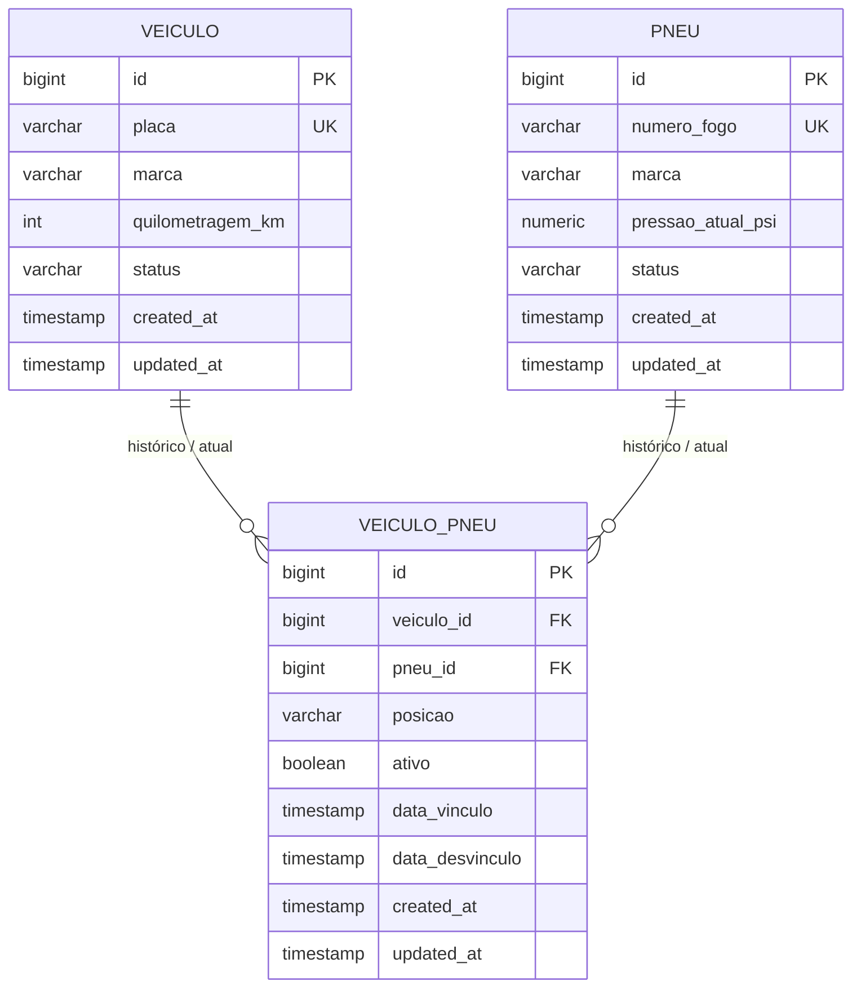

# veiculos-srv

API REST (Spring Boot 3, Java 17) para gestão de **veículos**, **pneus** e **vínculos** (posição no veículo), com PostgreSQL e migrações **Flyway**. Estrutura em camadas alinhada ao projeto de referência **gohome_srv_cantina** (`controller`, `service`, `repository`, `dto`, `entity`, `config`, `exception`). **JWT não é usado**; o Spring Security está configurado para permitir todos os endpoints (adequado ao escopo do teste).

## Pré-requisitos

- Java 17+
- Docker (para o Postgres e para os testes de integração com Testcontainers)

Não é obrigatório ter o Maven no `PATH`: o projeto inclui **Maven Wrapper** (`mvnw` / `mvnw.cmd`).

## Subir o banco (Docker)

Na raiz do projeto:

```bash
docker compose up -d
```

Isso sobe PostgreSQL 16 na porta **5434** no host (mapeada para 5432 no container). Banco `veiculos`, usuário/senha `veiculos`.

**Windows:** muitas instalações locais do PostgreSQL usam a porta **5433** no host; por isso o compose usa **5434** para não competir com `postgres.exe` na mesma porta (caso contrário `localhost:5433` pode autenticar no servidor errado e gerar `28P01`).

### Diagnóstico realizado (causa do erro `28P01`)

| # | Teste | Resultado |
|---|--------|-----------|
| 1 | `docker compose ps` — serviço e porta publicada | Container `veiculos-postgres` **Up (healthy)**; antes do ajuste: `0.0.0.0:5433->5432`. |
| 2 | Conexão TCP com usuário/senha `veiculos` | `docker exec ... psql` **OK** (socket local). `psql` via `host.docker.internal:5433` + senha → **FALHA** (`28P01`). |
| 3 | Volume antigo | Descartado como causa principal: o Postgres do container aceita `veiculos`/`veiculos` por TCP **dentro** do container. |
| 4 | Porta/credenciais | `netstat`/`Get-NetTCPConnection`: na **5433** do host havia **dois** listeners — `postgres.exe` (PostgreSQL nativo) e Docker. A JVM conectava em `localhost:5433` e podia cair no **Postgres errado** (sem o role/senha esperados). |

**Correção aplicada:** mapear o container em **5434** no host e alinhar `application.yaml` (`DB_PORT` padrão `5434`).

## Rodar a aplicação

Com o Postgres no ar, na pasta do projeto:

**Git Bash / Linux / macOS**

```bash
./mvnw spring-boot:run
```

**Windows (CMD ou PowerShell)**

```bat
mvnw.cmd spring-boot:run
```

Na primeira execução o wrapper baixa o Apache Maven para `~/.m2/wrapper` (precisa de internet).

Se você já tiver Maven instalado, `mvn spring-boot:run` também funciona.

A API fica em `http://localhost:8080` por padrão.

Variáveis úteis: `DB_HOST`, `DB_PORT`, `DB_NAME`, `DB_USERNAME`, `DB_PASSWORD`, `SERVER_PORT`.

## Endpoints (JSON)

| Método | Caminho | Descrição |
|--------|---------|-----------|
| `GET` | `/api/veiculos` | Lista todos os veículos **sem** pneus aplicados |
| `GET` | `/api/veiculos/{id}` | Detalhe do veículo **com** pneus ativos e respectivas **posições** |
| `POST` | `/api/veiculos` | Cadastra veículo (corpo: `placa`, `marca`, `quilometragemKm`, `status`) |
| `POST` | `/api/pneus` | Cadastra pneu (`numeroFogo`, `marca`, `pressaoAtualPsi`, `status`) |
| `POST` | `/api/veiculos/{id}/vinculos` | Vincula pneu ao veículo (`pneuId`, `posicao`). **Não permite** dois pneus ativos na mesma posição nem o mesmo pneu ativo em dois veículos |
| `POST` | `/api/veiculos/{id}/desvinculos` | Desvincula (`pneuId`): encerra vínculo ativo e marca pneu como disponível |

Valores de negócio usados no seed e na API: veículo `ATIVO` / `INATIVO`; pneu `EM_USO` / `DISPONIVEL`.

## Testes

Os testes de integração usam **Testcontainers** (PostgreSQL). É necessário **Docker em execução**.

```bash
mvn verify
```

## Modelo de dados e decisões

### Diagrama ER (conceitual)



### Por que cada tabela

1. **`veiculo`**  
   Entidade principal com atributos estáveis do veículo (placa única no cadastro, marca, quilometragem, status operacional). Timestamps permitem auditoria simples.

2. **`pneu`**  
   Representa o ativo “pneu” com identificação de negócio pelo **número de fogo** (único), marca, pressão atual e status de disponibilidade. Separa o cadastro do pneu do histórico de onde ele foi montado.

3. **`veiculo_pneu`**  
   Tabela de associação **N:N** entre veículo e pneu, com **histórico**: cada linha é um período de vínculo (`data_vinculo`, `data_desvinculo`, `ativo`). Assim um mesmo pneu pode ter passado por vários veículos ao longo do tempo sem perder rastreabilidade.

### Por que índices únicos parciais (`WHERE ativo`)

- **`(veiculo_id, posicao)` com `ativo = true`**: garante no banco que **não há dois pneus ativos na mesma posição** do mesmo veículo, mesmo sob concorrência.
- **`(pneu_id)` com `ativo = true`**: garante que um pneu **não fique montado em dois veículos ao mesmo tempo**.

A aplicação ainda valida essas regras antes do `INSERT` para retornar mensagens claras; o banco é a última linha de defesa.

## Flyway

- `V1__create_veiculo_pneu.sql`: cria tabelas, FKs e índices.
- `V2__seed_data.sql`: dados de exemplo (incluindo caminhão com pneu **188** na posição **A**, como no enunciado).

## Performance

- Listagem de veículos não carrega relacionamento com pneus (apenas `findAll` na entidade `Veiculo`).
- Detalhe do veículo usa consulta com `JOIN FETCH` nos vínculos ativos e pneus, evitando N+1 para a lista de pneus aplicados.

## Estrutura de pacotes

```
br.app.veiculos
├── VeiculosApplication
├── config
├── controller
├── dto
├── entity
├── exception
├── repository
└── service
```

Alinhado ao padrão do **gohome_srv_cantina** (separação controller → service → repository, DTOs de entrada/saída, configuração isolada).
